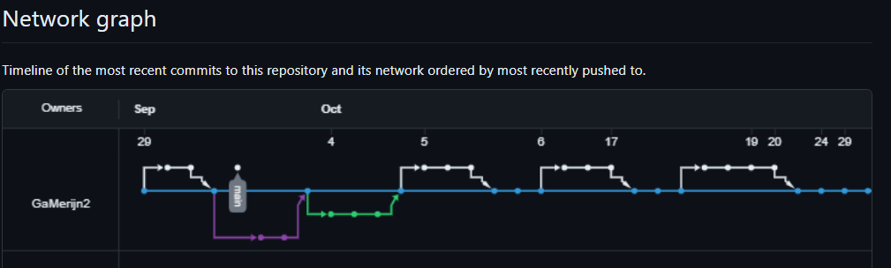

Product 1:


Product 2:


Product 3:


Product 4:


Product 5:


Product 6:
Nog mee bezig

Product 7:
Nog mee bezig

Product 8:
Nog mee bezig

Product 9:


# TowerDefenseTemplate
## Product 1: "DRY SRP Scripts op GitHub"

*"In dit script heb ik een bullet script staan waarbij je zelf de bullet prefab, de attackspeed, en de bullet travel speed kan kiezen (SRP).
Ik kan ook zelf via code de attackCooldown en bulletSpeed mee geven via code, zodat je dat niet zelf hoeft te doen in verschillende scripts voor verschillende torens (DRY). 
Link: https://pastebin.com/2S9RCFhq"*

## Product 2: "Projectmappen op GitHub"

My [Root](https://github.com/GaMerijn2/SD2TowerDefence/tree/develop/TD)

## Product 3: Build op Github

[Release 2.0.0](https://github.com/GaMerijn2/SD2TowerDefence/releases/tag/game)

## Product 4: Game met Sprites(animations) en Textures 


## Product 5: Issues met debug screenshots op GitHub 

[Link naar een issue](https://github.com/GaMerijn2/SD2TowerDefence/issues/1)

## Product 6: Game design met onderbouwing 

Je gebruikt een game design tool om je game design vast te leggen en te communiceren. Daarnaast onderbouw je de design keuzes ten aanzien van “playability” en “replayability” voor je game schriftelijk. 

Voorbeeld van een one page design:

Omschrijf per mechanic welke game design keuzes je hebt gemaakt en waarom je dit hebt gedaan.

*  **Je game bevat torens die kunnen mikken en schieten op een bewegend doel.** 

*Mijn torens hebben een range waarin ze enemy's kunnen detecteren, ook hebben ze een functie waardoor ik zelf kan kiezen of ze de eerste, laatste, zwakste of de sterkste enemy kunnen targeten.*

*  **Je game bevat vernietigbare vijanden die 1 of meerderen paden kunnen volgen.**  

*Mijn enemy's kunnen zelf kiezen zelk pad ze gaan gebruiken, dus ze kunnen kiezen tussen 1 van de 3 paths, en ik heb maar 1 enemy nu. dit wil ik gaan aanpassen in de toekomst en meerdere enemy's toevoegen met verschillende statistics.*

*  **Je game bevat een “wave” systeem waarmee er onder bepaalde voorwaarden (tijd/vijanden op) nieuwe waves met vijanden het veld in komen.**

*Mijn game heeft een wavesystem die enemy's spawned om de zoveel tijd, en steeds meer enemy's spawned.*

*  **Een “health” systeem waarmee je levens kunt verliezen als vijanden hun doel bereiken en zodoende het spel kunt verliezen.** 

*Mijn game heeft een health systeem voor mijn enemy's eb voor het eindpunt. De torens kunnen de enemy's vermoorden en de hoeveelheid Health de enemy's nog over hebben, dat i de hoeveelheid health die de base verliest wanneer er een enemy bij het einde aan komt.*

*  **Een “resource” systeem waarmee je resources kunt verdienen waarmee je torens kunt kopen en .evt upgraden.**

*Dit heb ik nog niet, maar daar was ik wel al mee bezig. dit is nog iets voor de toekomst van mijn game*

*  **Een “upgrade” systeem om je torens te verbeteren.**

*lees hierboven, hiervoor wil ik eerst de resource system opzetten en laten werken*

*  **Een “movement prediction” systeem waarmee je kan berekenen waar een toren heen moeten schieten om een bewegend object te kunnen raken. (Moeilijk)**

*Hier heb ik nog geen idee voor, geen idee of ik dit ga maken.*

## Product 7: Class Diagram voor volledige codebase 

Je brengt je volledige codebase in kaart met behulp van een class diagram. Binnen de classes hoeven geen private members te worden weergegeven. Wel alle public members (fields en methods). Ook geef je indien relevant de relaties tussen je classes weer. Je class diagram plaats je in je readme op github. Evt mag je dit doen m.b.v de [“Mermaid”](https://mermaid.js.org/syntax/classDiagram.html) tool.


```mermaid
---
title: Tower Defence Game
---
classDiagram
    name <|-- name

    name <|-- name
    name <|-- name
    name: +int name
    name: +String name
    name+name()
    name+name()
    class name{
        +String name
        +name()
        +name()
    }
    class name{
        -int name
        -cname()
    }
    class name{
        +bool name
        +name()
    }

```

## Product 8: Prototype test video
Je hebt een werkend prototype gemaakt om een idee te testen. Omschrijf if je readme wat het idee van de mechanics is geweest wat je wilde testen en laat een korte video van de gameplay test zien. 

[](https://www.youtube.com/watch?v=CzzRML1swF0)

## Product 9: SCRUM planning inschatting 

[Link naar mijn Trello](https://trello.com/b/gdFuLxI2/sd2td)

## Product 10: Gitflow conventions



